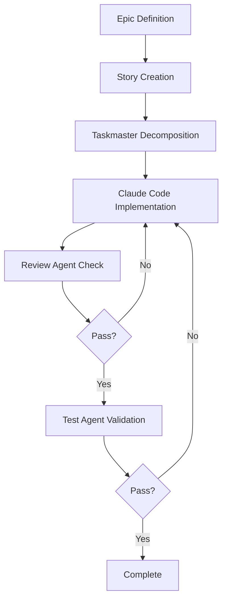

# Development Guide

This document provides comprehensive guidelines for developing with the Codebase Tutor.

## Getting Started

### Prerequisites

- Python 3.10+
- UV package manager
- Git

### Installation

```bash
git clone <your-repo>
cd codebase-tutor
uv sync
```

### Step 3: Set Up Development Tools

```bash
# Using UV package manager
uv init
uv add ruff pyright pytest
uv add --dev taskmaster claude-code
```

## 3. Design and Architecture Documentation

### Phase 1: Initial Exploration with Sequential Thinking

#### Installing Sequential Thinking MCP Server

To install the Sequential Thinking MCP server for use with Claude Code:

```bash
# Add the Sequential Thinking MCP server to Claude Code
claude mcp add-json "sequential-thinking" '{"command":"npx","args":["-y","@modelcontextprotocol/server-sequential-thinking"]}'
```

This command:

- Adds a new MCP server named "sequential-thinking"
- Configures it to run via `npx` with the official MCP Sequential Thinking package
- The `-y` flag automatically installs the package if not present

#### Verify Installation

```bash
# List available MCP servers to confirm installation
claude mcp list
```

#### Using Sequential Thinking for Problem Exploration

Once installed, use it for architectural exploration:

```bash
# Start a sequential thinking session
claude --mcp sequential-thinking "I need to design a distributed caching system for [your project]. Let's think through this step by step."

# For complex problems with multiple considerations
claude --mcp sequential-thinking "think harder about the trade-offs between different database architectures for our multi-tenant SaaS application"

# Explore alternative solutions
claude --mcp sequential-thinking "Let's explore different approaches to implementing real-time collaboration in our application"
```

The Sequential Thinking server will:

- Break down complex problems into manageable steps
- Allow revision and refinement of thoughts
- Branch into alternative reasoning paths
- Generate and verify solution hypotheses

Document the exploration results in `docs/extended-thinking/architecture-decisions/initial-exploration.md`

### Phase 2: Create Core Design Documents

#### A. Product Requirements (`docs/design.md`)

Work with Claude to create:

```markdown
# Project Name

## Vision

[One paragraph description]

## User Stories

As a [user type], I want to [action] so that [benefit]

## Functional Requirements

- FR1: [Requirement]
- FR2: [Requirement]

## Non-Functional Requirements

- Performance: [Specifications]
- Security: [Requirements]
- Scalability: [Targets]

## Acceptance Criteria

- [ ] Criteria 1
- [ ] Criteria 2
```

#### B. Technical Architecture (`docs/architecture.md`)

```markdown
# System Architecture

## Overview

[High-level system description]

## Components

### Component 1

- Purpose:
- Interfaces:
- Dependencies:

## Data Flow

[Diagrams and descriptions]

## Technology Stack

- Language: Python 3.11+
- Framework: FastAPI/PocketFlow
- Database: [Choice]
```

#### C. Flow Design (`docs/flow-design.md`)

Define specific flows using PocketFlow patterns:

```markdown
# Flow Specifications

## User Registration Flow

1. Node: ValidateInput
   - prep: Check email format
   - exec: Validate uniqueness
   - post: Transition to CreateUser

2. Node: CreateUser
   - prep: Hash password
   - exec: Store in database
   - post: Send welcome email
```

## 4. Task Organization and Decomposition

### Hierarchy of Planning

#### Level 1: Epics (Human + Claude)

Create in `planning/epics/`:

```markdown
# Epic: User Authentication System

## Objective

Implement secure user authentication with OAuth support

## Success Criteria

- Users can register and login
- OAuth integration with Google/GitHub
- Secure session management

## Dependencies

- Database schema design
- API framework selection
```

#### Level 2: User Stories (Human + Claude)

Create in `planning/stories/`:

```markdown
# Story: User Registration

## As a new user

I want to create an account
So that I can access the application

## Acceptance Criteria

- [ ] Email validation
- [ ] Password strength requirements
- [ ] Confirmation email sent
- [ ] Account activation flow

## Technical Notes

- Use PocketFlow nodes for each step
- Implement rate limiting
```

#### Level 3: Tasks (Taskmaster)

Use taskmaster for decomposition:

```bash
# Generate tasks from stories
claude-code "Use taskmaster to decompose the user stories in planning/stories/ into implementation tasks"

# Tasks will be created in .taskmaster/tasks/
```

### Task Workflow

1. **Human + Claude**: Define epics and stories through conversation
2. **Taskmaster**: Automatically decompose stories into tasks with dependencies
3. **Claude Code**: Implement tasks with guidance from CLAUDE.md
4. **Validate**: Confirm task completion before moving to next

### Task Completion and Testing Approach

#### Test-With-Development (Default Approach)

Claude Code follows a "test-with-development" pattern:

1. Implements the feature based on task requirements
2. Immediately writes tests for that implementation
3. Runs tests to verify functionality
4. Fixes any issues before moving to next task

This differs from traditional TDD where tests are written first. Benefits:

- Faster development flow
- Tests still ensure quality
- Natural progression through tasks
- Suitable for most projects

#### When to Use Traditional TDD

For critical features, explicitly request TDD:

```bash
# Request test-first development
claude-code "Using TDD, first write failing tests for the payment processing based on these requirements, then implement the code to make them pass"
```

#### Task Completion Criteria

A task is considered complete when:

1. **Code Implementation** - All functionality specified in task is written
2. **Tests Pass** - Claude-written tests validate the implementation
3. **Quality Checks** - Linting, formatting, and type checking pass
4. **Integration Works** - No regression in existing functionality

#### Progression Workflow

```bash
# 1. Implement current task
claude-code "Implement task_001 from .taskmaster/tasks/"

# 2. Claude automatically writes tests
claude-code "Write comprehensive tests for task_001 implementation"

# 3. Validate everything works
claude-code "Run validation: pytest, ruff check, pyright"

# 4. If all passes, progress to next
claude-code "task_001 complete with passing tests, now implement task_002"
```

## 5. Agent-Based Development Workflow

### Implementation and Execution Agents

At this stage, planning is complete (epics → stories → tasks). Now we focus on execution agents that help implement, review, and validate the work.

#### Agent Types and Their Roles

1. **Implementation Agent (Claude Code)**
   - Primary role: Execute tasks from .taskmaster/tasks/
   - Follows PocketFlow patterns and CLAUDE.md guidelines
   - Handles complex coding with extended thinking when needed

2. **Review Agent**
   - Reviews code for quality, patterns, and standards
   - Checks adherence to PocketFlow framework
   - Validates against acceptance criteria

3. **Test Enhancement Agent**
   - Expands test coverage beyond basic implementation tests
   - Identifies and tests edge cases missed during development
   - Creates cross-feature integration tests
   - Adds performance and security tests
   - Reviews test quality and completeness

4. **Documentation Agent**
   - Updates API documentation
   - Maintains architecture decision records
   - Keeps README and guides current

#### Creating Agent Patterns

Create agent-specific prompts for consistent behavior:

`agents/reviewer/code-review-prompt.md`:

```markdown
# Code Review Agent

## Review Checklist

- [ ] Follows PocketFlow node structure
- [ ] Implements proper error handling
- [ ] Has appropriate test coverage
- [ ] Matches existing code patterns
- [ ] Performance considerations addressed
- [ ] Security best practices followed

## Focus Areas

1. Code quality and readability
2. Framework compliance
3. Edge case handling
4. Performance implications
```

`agents/tester/test-enhancement-prompt.md`:

```markdown
# Test Enhancement Agent

## Purpose

Enhance existing test suites AFTER basic implementation tests are written.
Focus on gaps, edge cases, and cross-cutting concerns.

## Enhancement Areas

1. **Coverage Gaps**
   - Review existing tests for missing scenarios
   - Add edge cases and boundary conditions
   - Test error handling thoroughly

2. **Integration Testing**
   - Cross-feature interactions
   - End-to-end user journeys
   - System-wide regression tests

3. **Non-Functional Testing**
   - Performance benchmarks
   - Security vulnerability tests
   - Concurrency and race conditions
   - Memory and resource usage

4. **Test Quality Review**
   - Ensure tests validate business requirements
   - Check for test anti-patterns
   - Verify meaningful assertions

## When to Invoke

- After completing a group of related tasks
- Before major releases
- For critical features (auth, payments, data)
- When compliance requires extensive testing
```

### Implementation Workflow



### Using Extended Thinking

For complex problems:

```bash
# Trigger extended thinking
claude-code "think harder about implementing the distributed cache system"

# Document in extended-thinking folder
claude-code "Save your thinking process to docs/extended-thinking/algorithm-design/cache-design.md"
```

### Test Enhancement Workflow

Since Claude Code writes basic tests during implementation, use the test enhancement agent for deeper testing:

```bash
# After completing several related tasks
claude-code "Acting as a test enhancement specialist, review all tests in /tests for the authentication module and identify coverage gaps"

# Add sophisticated test scenarios
claude-code "Add edge case tests for concurrent login attempts, session hijacking prevention, and brute force protection"

# Cross-feature validation
claude-code "Create end-to-end tests that validate the complete user journey from registration through password reset"

# Performance testing
claude-code "Add load tests to ensure authentication can handle 1000 concurrent login requests"
```

This enhancement approach ensures:

- Basic tests exist from implementation phase
- Critical paths get extra scrutiny
- System-wide quality improves over time
- Testing effort is proportional to risk

## 6. Development Execution

### Daily Workflow

#### 1. Morning Planning

```bash
# Review current tasks
claude-code "Read the current tasks in .taskmaster/tasks/ and create a work plan for today"

# Update scratchpad
claude-code "Create planning/scratchpad/$(date +%Y%m%d)-plan.md with today's objectives"
```

#### 2. Implementation

```bash
# Start with highest priority task
claude-code "Implement task_001 following PocketFlow patterns"

# Use extended thinking for complex parts
claude-code "think hard about the optimal data structure for the citation graph"
```

#### 3. Testing

```bash
# Generate tests
claude-code "Create comprehensive tests for the implemented features"

# Run validation
uv run pytest
uv run ruff check .
uv run pyright
```

#### 4. Documentation

```bash
# Update documentation
claude-code "Update the API documentation for the new endpoints"

# Create decision records
claude-code "Document why we chose PostgreSQL over MongoDB in docs/extended-thinking/architecture-decisions/"
```

### Multi-Step Task Management

For complex, multi-step tasks:

```bash
# Create a working document
claude-code "Create planning/scratchpad/migration-checklist.md to track the database migration"

# Use as a checklist
claude-code "Update the migration checklist as you complete each step"
```

## 7. GitHub Template Structure

### Creating a Reusable Template

#### Repository Structure

```
your-template/
├── .github/
│   ├── ISSUE_TEMPLATE/
│   │   ├── epic.md
│   │   ├── story.md
│   │   └── bug.md
│   └── workflows/
│       └── ci.yml
├── .mdc/
│   └── pocketflow-rules.md
├── docs/
│   ├── templates/
│   │   ├── design-template.md
│   │   ├── architecture-template.md
│   │   └── flow-template.md
│   └── extended-thinking/
├── planning/
│   └── .gitkeep
├── agents/
│   └── templates/
├── CLAUDE.md.template
├── .cursorrules.template
├── setup.sh
└── README.md
```

#### Setup Script (`setup.sh`)

```bash
#!/bin/bash
# Project setup script

echo "Setting up new project..."

# Create directory structure
mkdir -p planning/{epics,stories,tasks,scratchpad}
mkdir -p docs/extended-thinking/{architecture-decisions,algorithm-design,integration-strategies}
mkdir -p agents/{planner,reviewer,tester}
mkdir -p .taskmaster/tasks
mkdir -p src tests

# Copy templates
cp CLAUDE.md.template CLAUDE.md
cp .cursorrules.template .cursorrules

# Initialize git
git init
git add .
git commit -m "Initial project structure"

echo "Project setup complete!"
```

### Using the Template

1. **Create from Template**:

   ```bash
   gh repo create my-project --template your-username/project-template
   cd my-project
   ./setup.sh
   ```

2. **Customize for Your Project**:

   ```bash
   claude-code "Help me customize the design.md template for a [your project type]"
   ```

3. **Start Planning**:

   ```bash
   # Begin with exploration
   claude-code "think harder about the architecture for [your project description]"

   # Create initial epics
   claude-code "Based on our discussion, create epics in planning/epics/"
   ```

## Best Practices Summary

1. **Always Start with Thinking**: Use extended thinking for complex architectural decisions
2. **Document Everything**: Keep decision records and reasoning in extended-thinking/
3. **Iterate on Design**: Use Sequential Thinking MCP for exploring alternatives
4. **Decompose Systematically**: Epics → Stories → Tasks
5. **Use Agents Appropriately**: Match agent type to task type
6. **Maintain Scratchpads**: Use markdown files for complex multi-step work
7. **Review Regularly**: Use review agents before committing
8. **Test Continuously**: Integrate testing throughout development

## Conclusion

This guide provides a structured approach to complex software development using:

- LLM-assisted planning and implementation
- PocketFlow framework for consistent architecture
- Systematic task decomposition
- Agent-based development patterns

The key is to leverage each tool for its strengths:

- **Sequential Thinking**: For exploration and alternative generation
- **Claude + Human**: For high-level design and story creation
- **Taskmaster**: For systematic task breakdown
- **Claude Code**: For implementation with context awareness
- **Agents**: For specialized tasks (planning, review, testing)

Remember to adapt this framework to your specific needs and iterate based on what works best for your project and team.
