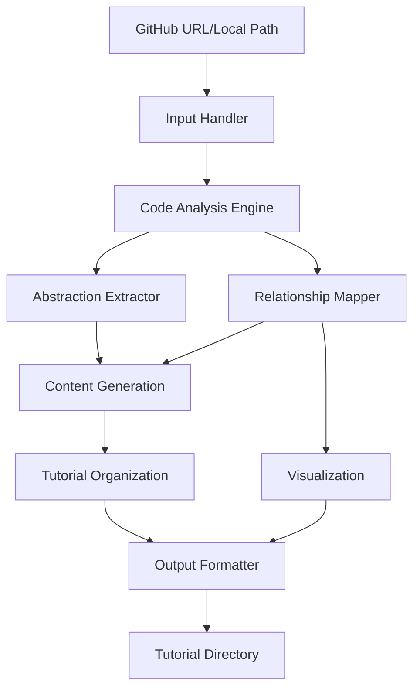
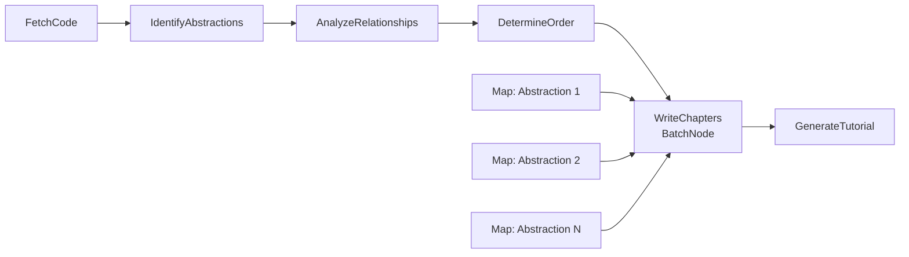

# Codebase Tutor Architecture Design

## Overview

The Codebase Tutor is an AI-powered system that analyzes codebases and generates beginner-friendly tutorials explaining the core abstractions, their relationships, and how they work together.

## Core Components

### 1. Input Handler

- **GitHubFetcher**: Downloads and clones GitHub repositories
- **LocalDirectoryReader**: Reads local directory structures
- **ProjectNameExtractor**: Derives project name from URL/path

### 2. Code Analysis Engine

- **LanguageDetector**: Identifies programming languages used
- **AbstractionExtractor**: Finds classes, modules, functions, and patterns
- **RelationshipMapper**: Discovers dependencies and interactions
- **ImportAnalyzer**: Tracks module dependencies
- **PatternRecognizer**: Identifies design patterns and architectural styles

### 3. Content Generation

- **ConceptSimplifier**: Converts technical concepts to beginner-friendly language
- **AnalogyGenerator**: Creates real-world analogies for abstract concepts
- **ExplanationBuilder**: Generates multi-line descriptions
- **CodeExampleSelector**: Picks illustrative code snippets

### 4. Visualization

- **MermaidDiagramBuilder**: Creates flowcharts showing relationships
- **GraphLayoutOptimizer**: Arranges nodes for clarity
- **LabelTranslator**: Generates descriptive labels

### 5. Tutorial Organization

- **ChapterPlanner**: Orders content logically for learning
- **DependencyResolver**: Ensures prerequisites come first
- **ComplexityGrader**: Arranges from simple to complex
- **LinkGenerator**: Creates navigation between chapters

### 6. Output Formatter

- **MarkdownWriter**: Generates clean markdown files
- **DirectoryStructurer**: Creates organized output directory
- **IndexBuilder**: Generates main index.md with TOC

## Data Flow

## Key Algorithms

### 1. Abstraction Detection

- AST (Abstract Syntax Tree) parsing for accurate code analysis
- Pattern matching for common abstractions
- Heuristics for importance scoring

### 2. Relationship Discovery

- Import/dependency graph construction
- Method call analysis
- Inheritance hierarchy mapping
- Composition/aggregation detection

### 3. Content Simplification

- Technical term glossary mapping
- Complexity reduction strategies
- Progressive disclosure of details

### 4. Learning Path Optimization

- Topological sorting of dependencies
- Complexity-based ordering
- Conceptual grouping

## Implementation Approach

### Phase 1: Core Analysis

1. Build language-agnostic abstraction extractor
2. Implement basic relationship mapping
3. Create simple Mermaid diagram generator

### Phase 2: Content Generation

1. Develop explanation templates
2. Build analogy database
3. Implement beginner-friendly language converter

### Phase 3: Tutorial Assembly

1. Create chapter organization logic
2. Build index generator
3. Implement navigation system

### Phase 4: Enhancement

1. Add multi-language support
2. Improve visualization layouts
3. Add interactive elements

## PocketFlow Integration

This project uses PocketFlow's **Workflow** and **BatchNode** patterns to orchestrate the tutorial generation process:

### Design Pattern: Workflow + Batch Processing

1. **Workflow Pattern**: The overall process follows a defined sequence:
   - `FetchCode` → `IdentifyAbstractions` → `AnalyzeRelationships` → `DetermineOrder` → `WriteChapters` → `GenerateTutorial`

2. **BatchNode Pattern**: The `WriteChapters` node uses MapReduce approach:
   - **Map Phase**: Process each abstraction independently to generate individual explanations
   - **Reduce Phase**: Combine all chapter content into structured tutorial files

### PocketFlow Node Structure

### Node Responsibilities

1. **FetchCode Node**
   - Input: GitHub URL or local path
   - Output: Code repository structure
   - Handles both remote and local sources

2. **IdentifyAbstractions Node**
   - Input: Code repository
   - Output: List of core abstractions with metadata
   - Uses AST parsing and pattern recognition

3. **AnalyzeRelationships Node**
   - Input: Abstractions list
   - Output: Relationship graph
   - Builds dependency and interaction maps

4. **DetermineOrder Node**
   - Input: Abstractions + relationships
   - Output: Ordered chapter list
   - Optimizes learning path

5. **WriteChapters BatchNode**
   - Input: Ordered abstractions
   - Map: Generate explanation for each abstraction
   - Reduce: Organize into chapter files
   - Uses AI for beginner-friendly content

6. **GenerateTutorial Node**
   - Input: Chapters + metadata
   - Output: Complete tutorial directory
   - Creates index.md, Mermaid diagrams, and navigation

### Benefits of This Approach

- **Modularity**: Each step is isolated and testable
- **Parallelization**: Chapter writing can process multiple abstractions concurrently
- **Scalability**: BatchNode handles any number of abstractions efficiently
- **Maintainability**: Clear separation of concerns
- **Flexibility**: Easy to add new processing steps or modify existing ones

## Technology Stack

- **Language**: Python 3.10+
- **Code Analysis**: AST, tree-sitter, pygments
- **AI/NLP**: Claude API for explanations
- **Visualization**: Mermaid.js
- **Output**: Markdown files
- **Framework**: PocketFlow for orchestration
