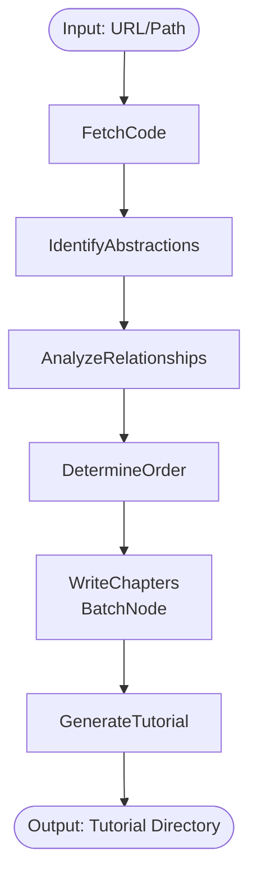

# Tutorial Generator Flow Design

## Overview

The Tutorial Generator uses PocketFlow's Workflow and BatchNode patterns to transform a codebase into a beginner-friendly tutorial.

## Flow Architecture

### Main Workflow: `TutorialGeneratorFlow`



## Node Specifications

### 1. FetchCode Node

**Purpose**: Retrieve source code from GitHub or local directory

**Input Schema**:

```python
{
    "source": str,  # GitHub URL or local path
    "project_name": Optional[str]  # Override derived name
}
```

**Output Schema**:

```python
{
    "project_name": str,
    "root_path": Path,
    "file_tree": Dict[str, Any],
    "main_language": str,
    "file_count": int
}
```

**Processing**:

- Detect if source is URL or path
- Clone GitHub repo or validate local path
- Extract project name from source
- Build file tree structure
- Detect primary language

### 2. IdentifyAbstractions Node

**Purpose**: Extract core abstractions from codebase

**Input**: Output from FetchCode

**Output Schema**:

```python
{
    "abstractions": List[{
        "id": str,
        "name": str,
        "type": str,  # class, function, module, interface
        "file_path": str,
        "line_number": int,
        "complexity": int,  # 1-10 scale
        "docstring": Optional[str],
        "members": List[str],  # methods, attributes
        "imports": List[str]
    }],
    "total_count": int
}
```

**Processing**:

- Parse source files using AST
- Identify classes, functions, modules
- Extract documentation
- Calculate complexity metrics
- Filter out boilerplate/trivial code

### 3. AnalyzeRelationships Node

**Purpose**: Map relationships between abstractions

**Input**: Abstractions list

**Output Schema**:

```python
{
    "relationships": List[{
        "from_id": str,
        "to_id": str,
        "type": str,  # inherits, uses, imports, calls
        "strength": float  # 0.0-1.0
    }],
    "dependency_graph": Dict,
    "clusters": List[List[str]]  # Related abstraction groups
}
```

**Processing**:

- Analyze inheritance hierarchies
- Track method calls and usage
- Map import dependencies
- Identify circular dependencies
- Group related abstractions

### 4. DetermineOrder Node

**Purpose**: Create optimal learning path

**Input**: Abstractions + Relationships

**Output Schema**:

```python
{
    "chapters": List[{
        "order": int,
        "title": str,
        "abstraction_ids": List[str],
        "difficulty": str,  # beginner, intermediate, advanced
        "prerequisites": List[int]  # chapter indices
    }],
    "learning_path": List[str]  # ordered abstraction IDs
}
```

**Processing**:

- Topological sort based on dependencies
- Group related abstractions
- Order by complexity (simple to complex)
- Ensure prerequisites come first
- Create logical chapter boundaries

### 5. WriteChapters BatchNode

**Purpose**: Generate explanations for each abstraction/chapter

**Batch Configuration**:

```python
{
    "batch_size": 5,  # Process 5 abstractions in parallel
    "map_function": "generate_explanation",
    "reduce_function": "organize_chapters"
}
```

**Map Input** (per abstraction):

```python
{
    "abstraction": AbstractionDetails,
    "context": {
        "related_abstractions": List,
        "position_in_learning_path": int,
        "project_overview": str
    }
}
```

**Map Output** (per abstraction):

```python
{
    "abstraction_id": str,
    "explanation": {
        "summary": str,
        "analogy": str,
        "detailed_description": str,
        "code_example": str,
        "common_use_cases": List[str],
        "relationships_explained": str
    }
}
```

**Reduce Output**:

```python
{
    "chapters": List[{
        "number": int,
        "title": str,
        "content": str,  # Markdown formatted
        "abstractions_covered": List[str]
    }]
}
```

**Processing**:

- **Map Phase**:
  - Use AI to generate beginner-friendly explanations
  - Create real-world analogies
  - Select illustrative code examples
  - Explain relationships in context
- **Reduce Phase**:
  - Combine related explanations into chapters
  - Add transitions between topics
  - Format as coherent markdown

### 6. GenerateTutorial Node

**Purpose**: Create final tutorial structure

**Input**: Chapters + all previous metadata

**Output Schema**:

```python
{
    "output_directory": Path,
    "files_created": List[str],
    "index_path": Path,
    "diagram_path": Path
}
```

**Processing**:

- Create output directory structure
- Generate index.md with:
  - Project overview
  - Mermaid relationship diagram
  - Chapter links
- Write individual chapter files
- Generate navigation elements
- Create README for the tutorial

## Error Handling

Each node should handle:

- Missing or invalid input gracefully
- Partial failures (e.g., some files can't be parsed)
- Resource limits (e.g., very large codebases)
- API rate limits (for AI explanations)

## Configuration Options

```python
{
    "max_abstractions": 100,  # Limit for large codebases
    "min_complexity": 3,  # Skip trivial code
    "languages_supported": ["python", "javascript", "java"],
    "explanation_style": "beginner",  # or "intermediate"
    "include_examples": True,
    "diagram_complexity": "simple"  # or "detailed"
}
```

## Performance Considerations

- **FetchCode**: Cache cloned repos
- **IdentifyAbstractions**: Process files in parallel
- **WriteChapters**: Batch API calls efficiently
- **GenerateTutorial**: Stream file writing

## Extension Points

1. **Language Plugins**: Add parsers for new languages
2. **Output Formats**: Support formats beyond Markdown
3. **Visualization Styles**: Alternative to Mermaid
4. **AI Providers**: Support multiple LLMs
5. **Customization**: User-defined templates
